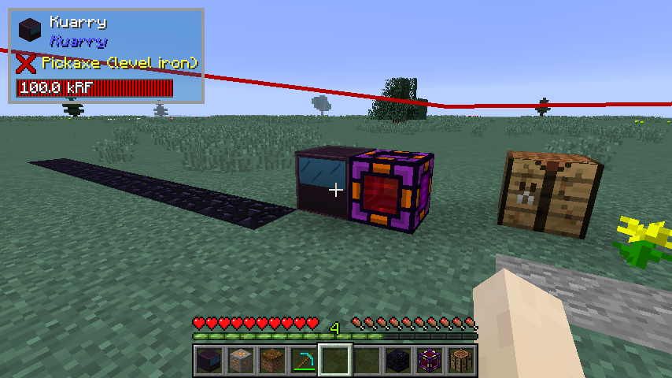
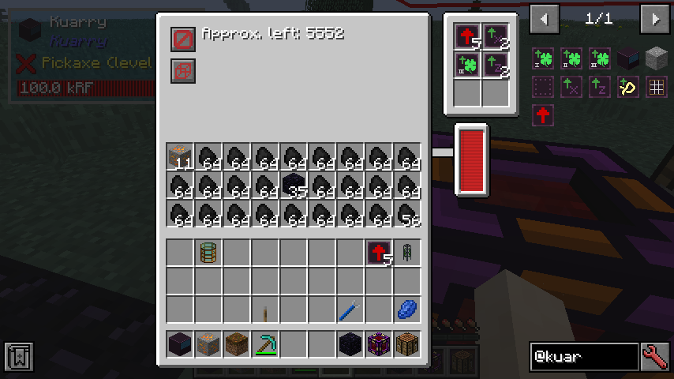
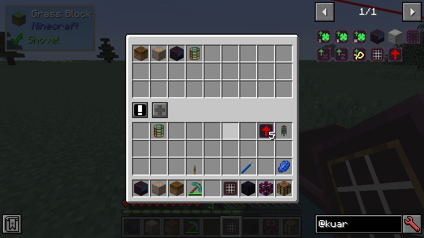

# Kuarry mod

Kuarry is a minecraft mod that adds an upgradable quarry that teleports resources to itself instead of
digging a huge hole in the ground, replacing these resources with a placeholder block called "denatured stone".
This block drops nothing most of the time, but sometimes you can get gravel from it.

The mod is on a very early stage right now and some player testing is needed, but the essential parts of it are
in.

## How to use the kuarry

All the items from the mod require a special item called "Kuarry casing". This item has several crafting
recipes, depending on the mods installed. You'll need either [Thermal Foundation][1], [EnderIO][2] or
[IndustrialCraft 2][3] to craft the plates. The plates are needed to craft both the kuarry and the upgrades.

## Energy

You'll need to have some mod that provides energy for the kuarry, as this mod does not include anything
that generates energy. Forge energy (aka redstone flux) and minecraft joules are supported as sources of energy,
but more _may_ be added if there is enough demand for it.

## Dependencies

The only dependency currently is [Shadowfacts' Forgelin][4], it is required because the mod is written in Kotlin.
It might be bundeled in the future, but for now it is not.

## Some screenshots

The kuarry showing the boundaries of the mining area.

The kuarry gui

The custom filter gui

[1]: https://www.curseforge.com/minecraft/mc-mods/thermal-foundation
[2]: https://www.curseforge.com/minecraft/mc-mods/ender-io
[3]: https://www.curseforge.com/minecraft/mc-mods/industrial-craft
[4]: https://www.curseforge.com/minecraft/mc-mods/shadowfacts-forgelin

